# 🦅 PocketCoder

**PocketCoder** is a personal research lab and an experiment in building a "Sovereign AI." It is a minimalist, local-first coding assistant designed with the philosophy of **Alpine Linux**: a tiny surface area that leverages the power of standard Unix tools.

I am building this as a solo developer because I believe that the most powerful tools shouldn't need a complex "Enterprise" footprint. Instead, PocketCoder uses high-leverage "giant's shoulders" like **PocketBase**, **Tmux**, and **OpenCode** to keep the custom glue code to an absolute minimum.

## 🧪 The Experiment
The goal is simple: *Can I build a secure, professional-grade coding environment that I can audit in a single afternoon?*

## 🛡 Personal Principles
- **Minimal Surface Area**: I prefer well-worn Unix tools over bespoke frameworks.
- **Sovereign Authority**: The reasoning engine is treated as a guest. All actions are gated by a human-inspectable log in PocketBase.
- **Extreme Portability**: The entire stack runs in a few lightweight Docker containers. It should feel as easy to self-host as your favorite static site.

## ⚠️ Disclaimer
PocketCoder is an active research project. As a solo developer, I’m building this in the open to share my progress. It is not a commercial product, and there are no support SLAs. If you find a bug, I'd love to hear about it, but please understand I'm moving at my own pace!

## 🚀 Quick Start (Local Setup)

1.  **Clone**: `git clone https://github.com/qtpi-bonding/pocketcoder.git`
2.  **Env**: `cp .env.example .env` (Add your Gemini API key)
3.  **Boot**: `docker-compose up -d`
4.  **Explore**: Access the PocketBase UI at `http://localhost:8090/_/`

## 🔗 Links
- [License](LICENSE) (AGPLv3)
- [Contributing](CONTRIBUTING.md)

---
*Built with heart by a solo dev in collaboration with **Gemini** (Google's agentic AI assistant). This project is as much an experiment in human-AI partnership as it is in software architecture.*

## Architecture: The Sovereign Loop

PocketCoder uses a **Physical Separation of Concerns**. The "Brain" (Reasoning) is isolated from the "Reality" (Sandbox) by a security relay.

```mermaid
graph TD
    User((👤 User))
    subgraph Client ["Client Interface"]
        UI[Flutter App]
    end

    subgraph ControlPlane ["Control Plane (PocketBase)"]
        PB[(DB & Auth)]
        Relay[Relay / Go]
    end

    subgraph Reasoning ["Reasoning"]
        OC[OpenCode]
    end

    subgraph Security ["Security"]
        Proxy[Proxy / Rust]
    end

    subgraph Execution ["Execution (Isolated)"]
        SB[Sandbox / Docker]
        Tmux[Tmux Session]
    end

    %% Flows
    User <--> UI
    UI <--> PB
    
    PB <-. Event Subscription .-> Relay
    Relay <--> OC
    
    OC <--> Proxy
    Proxy <--> SB
    SB <--> Tmux
```

## "Featherweight" Stats
*(Approximate Code counts as of Feb 2026)*

The value of PocketCoder isn't in how much code I wrote, but in how much I **didn't** have to write by leveraging great tools.

| Component | Tech | Lines | Role |
| :--- | :--- | :--- | :--- |
| **backend** | Go | ~900 | The "Gatekeeper" (Rules & Auth) |
| **relay** | Go | ~950 | The "Spinal Cord" (Reasoning Sync) |
| **proxy** | Rust | ~400 | The "Muscle" (Secure Tmux Bridge) |
| **sandbox** | Bash/Python | ~750 | The "Reality" (Isolated Runtime) |
| **CORE TOTAL**| | **~3,000** | **Tiny, Auditable, Transparent** |
