# 🦅 PocketCoder

**PocketCoder** is an experimental, self-hosted AI assistant. It explores the intersection of personal sovereignty and AI agent capabilities, designed to live quietly in your pocket or on your VPS.

## 🧪 The Experiment
PocketCoder is a research project investigating a simple question: *Can we build a powerful, professional-grade coding assistant that is 100% self-hosted and user-controlled?*

To answer this, we are stitching together some of the best open-source technologies into a cohesive system:
- **OpenCode**: For high-level reasoning and agentic loops.
- **PocketBase**: For a lightweight, portable backend and permission system.
- **Tmux**: For resilient, recovering shell sessions.

## 🛡 Core Values
- **Minimal Surface Area**: We rely on battle-tested infrastructure (PocketBase, Tmux, Docker) with minimal custom glue code (~1,800 LOC). Less code means fewer bugs and a smaller attack surface.
- **Ownership**: You should own your data, your logs, and your API keys.
- **Privacy**: No telemetry. No hidden usage tracking. Just code.

## ⚠️ License & Use
PocketCoder is open-source software licensed under the **GNU Affero General Public License v3.0 (AGPLv3)**.

We chose this license to ensure that if PocketCoder is ever used to provide a network service, the improvements returned to the community remain open.

*   **Individuals & Researchers**: Free to use, modify, and explore.
*   **Commercial/Proprietary**: If you wish to embed this into a closed-source product, please reach out regarding a commercial license.

## 🚀 Getting Started (TODO: Detailed Guide Here)

This section will provide a quick start guide for new users to get PocketCoder up and running locally.

<!-- TODO:
- Prerequisites (Docker, Git, etc.)
- Clone the repository
- `docker-compose up -d`
- Initial configuration steps
- How to access the Flutter UI
- Basic first interaction with the AI assistant
-->

## 🔗 Links
- [License](LICENSE) (AGPLv3)

---
*Built on the shoulders of giants. Inspired by the pioneering work of OpenClaw and the power of OpenCode.*

## Architecture: The Sovereign Loop

PocketCoder operates on a **Physical Separation of Concerns**. The reasoning engine is isolated from the execution environment by a security relay.

```mermaid
graph TD
    User((👤 User))
    subgraph Client ["📱 Flutter App"]
        UI[User Interface]
    end

    subgraph ControlPlane ["Control Plane"]
        PB[(PocketBase)]
        Relay[Relay]
    end

    subgraph Reasoning ["Reasoning"]
        OC[OpenCode]
    end

    subgraph Security ["Security"]
        Proxy[Proxy]
    end

    subgraph Execution ["Execution"]
        SB[Sandbox]
        Tmux[Tmux Session]
    end

    %% Flows
    User <--> UI
    UI <--> PB
    
    PB <-. Subscription .-> Relay
    Relay <--> OC
    
    OC <--> Proxy
    Proxy <--> SB
    SB <--> Tmux
```

## Codebase Stats: "Featherweight Industrial"
*(LOC counts are approximate and for initial estimation only.)*

We prioritize high-leverage tools over custom code. The entire platform matches Enterprise capabilities with less than 2,000 lines of code.

| **pocketbase** | Go | ~900 | **Sovereign Authority**: Identity, Realtime, Permission Whitelisting |
| **relay** | Node.js | ~650 | **Control Plane**: Proxies messages, handles intents, syncs SSH keys |
| **proxy** | Rust | ~300 | **Execution Proxy**: Secure TMUX bridge for shell commands |
| **sandbox** | Docker/Tmux | ~100 | **Isolated Runtime**: Persistent terminal sessions |
| **TOTAL** | | **~1,950** | **Lean, Auditable, High-Leverage** |
