# 🦅 PocketCoder

**PocketCoder** is an experimental, self-hosted AI assistant. It explores the intersection of personal sovereignty and AI agent capabilities, designed to live quietly in your pocket or on your VPS.

## 🧪 The Experiment
PocketCoder is a research project investigating a simple question: *Can we build a powerful, professional-grade coding assistant that is 100% self-hosted and user-controlled?*

To answer this, we are stitching together some of the best open-source technologies into a cohesive system:
- **OpenCode**: For high-level reasoning and agentic loops.
- **PocketBase**: For a lightweight, portable backend and permission system.
- **Tmux**: For resilient, recovering shell sessions.

## 🛡 Core Values
- **Minimal Surface Area**: We rely on battle-tested infrastructure (PocketBase, Tmux, Docker) with minimal custom glue code (~1,800 LOC). Less code means fewer bugs and a smaller attack surface.
- **Ownership**: You should own your data, your logs, and your API keys.
- **Privacy**: No telemetry. No hidden usage tracking. Just code.

## ⚠️ License & Use
PocketCoder is open-source software licensed under the **GNU Affero General Public License v3.0 (AGPLv3)**.

We chose this license to ensure that if PocketCoder is ever used to provide a network service, the improvements returned to the community remain open.

*   **Individuals & Researchers**: Free to use, modify, and explore.
*   **Commercial/Proprietary**: If you wish to embed this into a closed-source product, please reach out regarding a commercial license.

## 🔗 Links
- [License](LICENSE) (AGPLv3)

---
*Built on the shoulders of giants. Inspired by the pioneering work of OpenClaw and the power of OpenCode.*

## 🏗️ Architecture: The "Sovereign Loop"

PocketCoder operates on a **Physical Separation of Concerns**. The "Brain" (AI) is isolated from the "Hands" (Execution) by a security firewall.

```mermaid
graph TD
    User((👤 User))
    subgraph Client ["📱 Flutter App"]
        UI[User Interface]
    end

    subgraph Core ["🏰 Control Plane"]
        PB[(PocketBase)]
        Auth[Auth System]
        Stream[Hot Pipe Stream]
        ColdPipe[Cold Pipe Logs]
    end

    subgraph Brain ["🧠 OpenCode Agent"]
        Logic[Reasoning Engine]
        subgraph Plugins
            Gatekeeper[🛡️ Gatekeeper Plugin]
            Comms[📡 Chat Plugin]
        end
    end

    subgraph Security ["🔥 The Firewall"]
        Gateway[Gateway Proxy]
    end

    subgraph Hands ["🛠️ Sandbox"]
        Tmux[Tmux Session]
        Shell[Bash Shell]
    end

    %% Flows
    User <--> UI
    UI <-->|"HTTP / Realtime"| PB
    
    Logic <-->|"Auth & Data"| PB
    Comms -->|"Stream Logs"| Stream
    Comms -->|"Write Files"| ColdPipe

    Logic -->|"Execute Command"| Gateway
    Gateway --"Intercepts"--> Tmux
    Tmux --"Runs"--> Shell
    Shell --"Output"--> Tmux
    Tmux --> Gateway --> Logic
```

## 📊 Codebase Stats: "Featherweight Industrial"

We prioritize high-leverage tools over custom code. The entire platform matches Enterprise capabilities with less than 2,000 lines of code.

| Component | Technology | LOC | Role |
| :--- | :--- | :--- | :--- |
| **Backend** | Go (PocketBase) | ~830 | **The Authority**: Identity, Realtime, Schema |
| **Gateway** | Rust | ~340 | **The Enforcer**: Security Firewall, Dumb Proxy |
| **Plugins** | TypeScript | ~390 | **The Diplomats**: Permissions logic, Logging |
| **Sandbox** | Bash / TS | ~125 | **The Hands**: Pure execution environment |
| **Infra** | Docker Compose | ~120 | **The Universe**: Orchestration & Networking |
| **TOTAL** | | **~1,805** | **Efficient, Auditable, Maintainable** |
