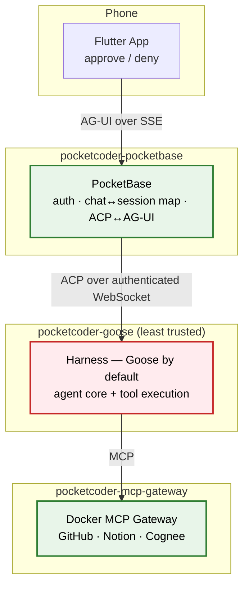

# Security Architecture

PocketCoder is designed with a "paranoid by default" posture: assume the model can hallucinate, make mistakes, or be manipulated, and put a human approval gate in front of anything it wants to *do*. This document describes the **current** runtime honestly — including where isolation is deliberately simplified today and what remains dormant future work.

## 1. The Core Principle: Approval-Gated Execution

The agent core (the **harness container**, Goose by default) can reason freely, but it cannot take a consequential action without your explicit say-so. Every tool call the harness wants to make surfaces through the ACP `session/request_permission` flow, which **PocketBase** turns into a real-time approve/deny prompt on your phone.

- **PocketBase** is the authenticated front door. It verifies the chat owner, holds the single `chat_id → goose_session_id` mapping, and translates between ACP (facing the harness) and AG-UI (facing the phone). It holds no model credentials of its own beyond the secret used to reach the harness.
- **The harness container** is the **least-trusted** container. It is where tool execution actually happens. It is modeled as "assume this could be compromised," and the isolation around it is what bounds the blast radius.

**You hold the approvals. The agent only acts within what you've approved.**

## 2. The Human-in-the-Loop Approval Gate

How a tool call is gated:

1. The harness decides to call a tool and issues an ACP `session/request_permission` with a fixed set of offered options (e.g. allow-once, allow-always, reject-once).
2. PocketBase records this as an **in-memory** pending permission holding the raw ACP request ID and the exact offered options, and pushes an AG-UI `STATE_DELTA` so your phone shows the prompt.
3. You pick one offered option. PocketBase forwards it **verbatim** to the harness and does not persist it in PocketBase's database.
4. The harness proceeds (or not) according to your choice.

Pending approvals are **process-local** and expire after `GOOSE_PERMISSION_TIMEOUT` (five minutes by default). Expiry, cancellation, and a graceful PocketBase shutdown all send the harness a `cancelled` decision so it never hangs blocked. Approvals are **never persisted or replayed** — a PocketBase restart intentionally drops any in-flight approval; the durable harness session simply resumes on the next run via ACP `session/load`.

## 3. Network Isolation

- The harness container **publishes no host port**. The statically-declared default (Goose in `docker-compose.yml`) joins a private `pocketcoder-agent` network shared only with PocketBase. A dynamically provisioned harness (any harness the coordinator spins up on selection) joins more: the same agent network, a shared harness-egress network, the MCP-gateway network, the memory network, and — when Ollama is configured — the model network too. It is not a two-node island; it's scoped away from the host and from PocketBase's own Docker-control path, not from every other service.
- The PocketBase↔harness channel is an **authenticated** ACP-over-WebSocket connection. The harness refuses to serve without `GOOSE_SERVER__SECRET_KEY`; PocketBase is the only component holding that secret, and it is not exposed to the Flutter client.
- The harness holds no PocketBase credentials — there is no harness→PocketBase call path that carries authority. It can, however, hold *provider* credentials: a harness's persistent auth-home volume may contain an API key or OAuth token for whichever model provider it was configured against, which is why the harness's own volume matters for blast-radius reasoning even though it can't reach PocketBase's data.
- The shared network is bidirectional, so this is an **identity- and scope-based** boundary, not an air gap: a compromised harness could *reach* `pocketbase:8090`, but it holds no PocketBase credentials and is bounded by PocketBase's collection access rules.
- `docker-socket-proxy-write` gives PocketBase a **scoped** Docker API (container restart/logs) instead of the raw socket.

## 4. Where Isolation Is Deliberately Simplified Today

Be clear-eyed about the current runtime:

- **The harness executes its own built-in shell and filesystem tools inside its own container.** In the current simplified runtime there is *no* separate hardened execution sandbox in the request path — PocketBase advertises no ACP filesystem/terminal callbacks and has no network route to a sandbox. The approval gate (§2) is what stands between the model and execution, not a second container.
- **The Rust sandbox proxy and its ACP adapter remain in the repository but are dormant** — future security-hardening work, not part of the PocketBase↔harness path today.
- **The MCP gateway runs in the core stack, while Cognee memory is optional.** MCP tool attachment through the selected harness build is not yet validated, so external MCP tools — and the assumption that their calls also pass through the approval gate — should not be taken for granted until that work lands.
- **Phone approval is the default, not an unconditional guarantee.** Each session profile can carry configured tool-permission rules (allow / ask / deny, matched by tool name or pattern). A rule set to allow or deny resolves automatically without a round trip to your phone; only tools that fall through to "ask" — the default when no rule matches — actually surface the approve/deny prompt described in §2. Auto-decisions still flow through the harness's own ACP permission mechanism, so nothing bypasses it entirely, but "every tool call reaches your phone" is only true until you (or a profile) configure a rule that says otherwise.

The upshot: the harness holds no PocketBase authority, and every tool call is still gated through its ACP permission flow — but that gate resolves against configured rules first, with phone approval as the default outcome rather than an unconditional one, and it is not yet the multi-container reasoning/execution air gap that the dormant sandbox components are intended to eventually provide.

## 5. Immutable & Recoverable Infrastructure

- **Compiled binary:** PocketBase runs as a compiled Go binary.
- **Ephemeral execution:** If the agent thrashes its own container, restart the harness container — its session store persists independently (`goose_data` volume), so history survives while transient damage does not.
- **Separated durable state:** PocketBase state (`pb_data`) and harness state (`goose_data`) are separate volumes, backed up independently.
- The included PocketBase backup volume is an on-host recovery copy. It is not an off-host disaster backup: VPS loss, disk failure, or provider/account loss can still destroy it. Administrators who need disaster recovery must export the volumes to storage they control.
- MCP OAuth credentials are deployment-global by design. Authenticated household members share the approved MCP configuration and its credentials; this is not per-user credential isolation.

## Summary

| Layer | Control |
|:---|:---|
| **Execution** | Tool calls are gated through the harness's ACP permission flow; phone approval is the default outcome, but configured allow/deny rules can resolve a call automatically. |
| **Channel** | PocketBase↔harness is an authenticated WebSocket; only PocketBase holds `GOOSE_SERVER__SECRET_KEY`. |
| **Network** | The harness publishes no host port and holds no PocketBase credentials, but a dynamically provisioned harness joins several service networks (egress, MCP gateway, memory, and model when Ollama is in use), not just PocketBase's. |
| **Blast radius** | The harness container is treated as untrusted and holds no PocketBase credentials, but its auth-home volume can hold persistent provider credentials; restart recovers cleanly from thrashing, not from a leaked provider key. |
| **Honest caveat** | Tools currently execute inside the harness container itself; the hardened sandbox is dormant future work. |

## Reporting a Vulnerability

This is a solo research project without a formal disclosure program. If you find a security issue, please open an issue (or contact the maintainer privately for sensitive reports) with enough detail to reproduce. There are no SLAs, but security reports are prioritized.
