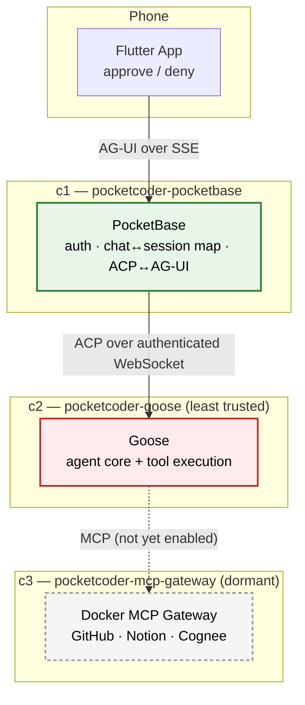

# Security Architecture

PocketCoder is designed with a "paranoid by default" posture: assume the model can hallucinate, make mistakes, or be manipulated, and put a human approval gate in front of anything it wants to *do*. This document describes the **current** runtime honestly — including where isolation is deliberately simplified today and what remains dormant future work.

## 1. The Core Principle: Nothing Runs Without Approval

The agent core (**Goose**, in container **c2**) can reason freely, but it cannot take a consequential action without your explicit say-so. Every tool call Goose wants to make surfaces through the ACP `session/request_permission` flow, which **c1 (PocketBase)** turns into a real-time approve/deny prompt on your phone.

- **c1 (PocketBase)** is the authenticated front door. It verifies the chat owner, holds the single `chat_id → goose_session_id` mapping, and translates between ACP (facing Goose) and AG-UI (facing the phone). It holds no model credentials of its own beyond the secret used to reach Goose.
- **c2 (Goose)** is the **least-trusted** container. It is where tool execution actually happens. It is modeled as "assume this could be compromised," and the isolation around it is what bounds the blast radius.

**You are the ultimate authority. The agent is a guest in your machine.**

## 2. The Human-in-the-Loop Approval Gate

How a tool call is gated:

1. Goose decides to call a tool and issues an ACP `session/request_permission` with a fixed set of offered options (e.g. allow-once, allow-always, reject-once).
2. c1 records this as an **in-memory** pending permission holding the raw ACP request ID and the exact offered options, and pushes an AG-UI `STATE_DELTA` so your phone shows the prompt.
3. You pick one offered option. c1 forwards it **verbatim** to Goose and stores nothing in PocketBase.
4. Goose proceeds (or not) according to your choice.

Pending approvals are **process-local** and expire after `GOOSE_PERMISSION_TIMEOUT` (five minutes by default). Expiry, cancellation, and a graceful c1 shutdown all send Goose a `cancelled` decision so it never hangs blocked. Approvals are **never persisted or replayed** — a c1 restart intentionally drops any in-flight approval; the durable Goose session simply resumes on the next run via ACP `session/load`.

## 3. Network Isolation

- Goose (c2) **publishes no host port** and joins only a shared private `pocketcoder-agent` network with exactly two nodes: PocketBase and Goose.
- The c1↔c2 channel is an **authenticated** ACP-over-WebSocket connection. Goose refuses to serve without `GOOSE_SERVER__SECRET_KEY`; **only c1 holds that secret**, and it is never exposed to the Flutter client.
- Goose holds **no PocketBase credentials**. There is no goose→PocketBase call path that carries authority — PocketBase is the sole record of the chat↔session mapping, and Goose is the sole record of history, so neither needs to trust the other with secrets.
- The shared network is bidirectional, so this is an **identity- and scope-based** boundary, not an air gap: a compromised Goose could *reach* `pocketbase:8090`, but it holds no credentials and is bounded by PocketBase's collection access rules.
- `docker-socket-proxy-write` gives PocketBase a **scoped** Docker API (container restart/logs) instead of the raw socket.

## 4. Where Isolation Is Deliberately Simplified Today

Be clear-eyed about the current runtime:

- **Goose executes its own built-in shell and filesystem tools inside c2.** In the current simplified runtime there is *no* separate hardened execution sandbox in the request path — c1 advertises no ACP filesystem/terminal callbacks and has no network route to a sandbox. The approval gate (§2) is what stands between the model and execution, not a second container.
- **The Rust sandbox proxy and its ACP adapter remain in the repository but are dormant** — future security-hardening work, not part of the c1/c2 path today.
- **The c3 MCP gateway runs in the core stack, while Cognee memory is optional.** MCP tool attachment through the selected Goose build is not yet validated, so external MCP tools — and the guarantee that their calls also pass through the approval gate — should not be assumed until that work lands.

The upshot: today's security story is **"every action requires human approval, over an authenticated channel, from a container that holds no credentials"** — a strong gate, but not yet the multi-container reasoning/execution air gap that the dormant sandbox components are intended to eventually provide.

## 5. Immutable & Recoverable Infrastructure

- **Compiled binary:** PocketBase runs as a compiled Go binary.
- **Ephemeral execution:** If the agent thrashes its own container, restart c2 — Goose's session store persists independently (`goose_data` volume), so history survives while transient damage does not.
- **Separated durable state:** PocketBase state (`pb_data`) and Goose state (`goose_data`) are separate volumes, backed up independently.
- The included PocketBase backup volume is an on-host recovery copy. It is not an off-host disaster backup: VPS loss, disk failure, or provider/account loss can still destroy it. Administrators who need disaster recovery must export the volumes to storage they control.
- MCP OAuth credentials are deployment-global by design. Authenticated household members share the approved MCP configuration and its credentials; this is not per-user credential isolation.

## Summary

| Layer | Control |
|:---|:---|
| **Execution** | No tool call runs without an explicit, offered-option approval relayed from your phone. |
| **Channel** | c1↔c2 is an authenticated WebSocket; only c1 holds `GOOSE_SERVER__SECRET_KEY`. |
| **Network** | Goose publishes no host port; sits on a 2-node private net; holds no PocketBase credentials. |
| **Blast radius** | c2 is treated as untrusted and holds no durable secrets; restart recovers cleanly. |
| **Honest caveat** | Tools currently execute inside c2 itself; the hardened sandbox and c3 MCP gateway are dormant future work. |

## Reporting a Vulnerability

This is a solo research project without a formal disclosure program. If you find a security issue, please open an issue (or contact the maintainer privately for sensitive reports) with enough detail to reproduce. There are no SLAs, but security reports are prioritized.
