This document provides a detailed overview of PocketCoder's architecture, outlining its core services, their interactions, and the design principles that govern the system. It aims to offer a clear understanding of how the various components work together to deliver a secure, self-hosted AI assistant.

## TL;DR - Current State

**Services:**
- ✅ **relay** (Node.js) - Intercepts tool/permission requests, handles agent deployment, and manages message synchronization with PocketBase.
- ✅ **pocketbase** (Go) - Handles auth, storage, and auto-authorizes safe operations.
- ✅ **proxy** (Rust) - Execution relay for localized commands.
- ✅ **sandbox** (Tmux) - Isolated execution environment.
- ✅ **opencode** (Reasoning) - The core agentic engine.

---

## System Overview

PocketCoder is a permission-gated AI coding assistant designed with a clear separation of concerns, orchestrating interactions between its core services:

1.  **Client (Flutter App):** The user interface for interacting with PocketCoder, displaying information, and allowing user intervention for permissions.
2.  **opencode (Reasoning Engine):** The external AI agent that performs high-level reasoning and decision-making, requesting permissions and command execution from the system.
3.  **pocketbase (Go Backend):** The central authority for identity, data persistence, real-time events, and initial permission arbitration. All state, audit logs, and agent configurations are stored here.
4.  **relay (Node.js):** The communication bridge and orchestrator between the `opencode` reasoning engine and `pocketbase`. It handles permission request interception, AI agent deployment, and message synchronization.
5.  **proxy (Rust):** A secure execution relay that mediates command execution requests from `opencode` to the `sandbox`.
6.  **sandbox (Docker/Tmux):** An isolated and persistent environment where shell commands are executed. It provides a secure context for `proxy` to interact with.

These services form the "Sovereign Loop," where the reasoning engine (`opencode`) is strictly isolated from direct execution, with all critical actions and data flows mediated and audited through the control plane (`pocketbase` and `relay`) and the security relay (`proxy`).

### Service Diagram (Simplified)

```mermaid
graph TD
    User((👤 User))
    subgraph Client ["📱 Flutter App"]
        UI[User Interface]
    end

    subgraph ControlPlane ["Control Plane"]
        PB[(pocketbase)]
        Relay[relay]
    end

    subgraph Reasoning ["Reasoning"]
        OC[opencode]
    end

    subgraph Security ["Security Relay"]
        Proxy[proxy]
    end

    subgraph Execution ["Execution"]
        SB[sandbox]
        Tmux[Tmux Session]
    end

    %% Flows
    User <--> UI
    UI <--> PB
    
    OC <--> Relay
    Relay <--> PB
    
    OC --> Proxy
    Proxy --> SB
    SB <--> Tmux
```

---

## Permission Flow: The Sovereign Authority

PocketCoder uses a **Whitelist-First** security model, where PocketBase acts as the "Sovereign Authority" for all agent intents.

### Whitelist-First Execution (Auto-Authorized)

1. **OpenCode** asks for permission (e.g., `bash: git status`).
2. **Relay** receives the request and POSTs to PocketBase `/api/pocketcoder/permission`.
3. **PocketBase** evaluates the intent against `whitelist_actions` (Verbs) and `whitelist_targets` (Nouns).
4. If a match is found:
    - PocketBase creates a `permissions` record with status `authorized`.
    - PocketBase returns `{ permitted: true }`.
    - **Relay** immediately tells **OpenCode** to proceed (`once`).
5. If NO match is found:
    - PocketBase creates a `permissions` record with status `draft`.
    - PocketBase returns `{ permitted: false, status: "draft" }`.
    - **Relay** waits for a realtime update on the `permissions` collection.
    - **User** approves manually via the UI.
    - **Relay** receives the `authorized` event and tells **OpenCode** to proceed.

---

## Database Schema

### `permissions` Collection (Intents)
- `opencode_id`: Unique ID from the reasoning engine.
- `session_id`: OpenCode session context.
- `chat`: Relation to the `chats` collection.
- `permission`: Type (bash, write, read, etc).
- `patterns`: List of target nouns (file paths, URLs).
- `status`: `draft`, `authorized`, `denied`.
- `message`: Descriptive request summary.
- `source`: Service that initiated the intent.
- `challenge`: Random UUID for cryptographic signing (future proofing).

### `whitelist_actions` / `whitelist_targets`
- Collections used by the Sovereign Authority to auto-approve intents based on patterns (e.g., `bash: git status` or `write: /workspace/**`).

---

## Service Responsibilities

### relay (Node.js)
- **Control Plane Orchestrator**: Bridges User messages in PocketBase to OpenCode sessions.
- **Intent Proxy**: Intercepts `permission.asked` events and coordinates with the PocketBase Sovereign Authority.
- **SSH Key Sync**: Manages a background service (`sync_ssh_keys.mjs`) that pulls active keys from PocketBase and updates the Sandbox's `authorized_keys`.

### pocketbase (Go)
- **Sovereign Authority**: Custom Go logic implements the `/api/pocketcoder/permission` endpoint for centralized intent arbitration.
- **Rule Engine**: Standard PocketBase API rules restrict data access for "Agents" vs "Humans".

### proxy (Rust)
- **Dumb Execution Proxy**: A high-performance Rust service that exposes an `/exec` endpoint.
- **TMUX Controller**: Directly communicates with the TMUX socket in the sandbox to run commands and poll for completion using exit code sentinels.

### sandbox (Docker/Tmux)
- **Isolated User-space**: Persistent terminal sessions managed by TMUX.
- **Key Manager**: Receives synced SSH keys via a shared volume to enable secure external access.

---

## Key Design Principles

1. **Physical Separation**: Reasoning (`opencode`) is networking-isolated from Execution (`sandbox`).
2. **Persistence**: Every intent and result is stored in `pocketbase` for auditability and recovery.
3. **Zero-Trust**: The reasoning engine (`opencode`) is treated as a guest. It cannot execute anything that hasn't been explicitly authorized by the user (or an auto-authorization rule) in `pocketbase`.
4. **Auditability**: All actions, permissions, and command executions are logged in `pocketbase` for a complete audit trail.
5. **Resilience**: Leveraging `tmux` in the `sandbox` for persistent sessions and `pocketbase` for state ensures operational resilience.

---

