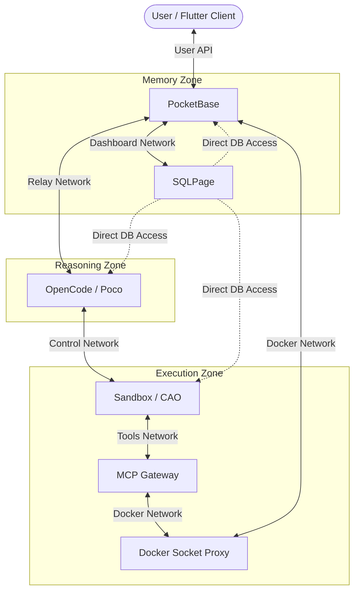
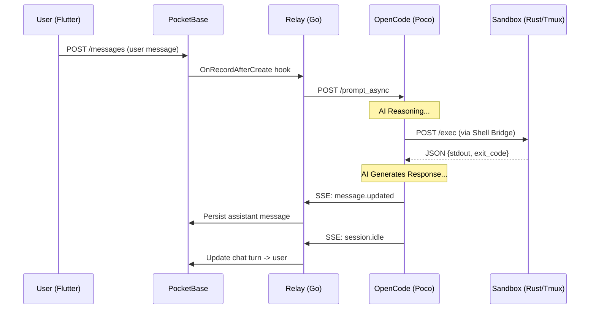

# PocketCoder System Architecture

## What This Document Is

A ground-truth reference for how PocketCoder actually works right now. Every claim here is traced to a specific file in the codebase. If the code changes and this doc doesn't match, the code wins.

## The Core Infrastructure

PocketCoder runs five primary service containers, coordinated via Docker Compose. This architecture separates user management, reasoning, execution, and tool infrastructure.



**Networks** (defined in `docker-compose.yml`):
- `pocketcoder-relay`: PocketBase ↔ OpenCode only (User communication & State sync)
- `pocketcoder-control`: OpenCode ↔ Sandbox (Command execution / PTY bridge)
- `pocketcoder-tools`: Sandbox ↔ MCP Gateway (External tool orchestration)
- `pocketcoder-docker`: PocketBase / Gateway ↔ Docker Proxy (Host orchestration)
- `pocketcoder-dashboard`: SQLPage ↔ Databases (Internal observability)

**The Linear Isolation Rule**:
The Sandbox cannot reach PocketBase directly. It only receives command requests from the Head (OpenCode) via a synchronous Rust bridge or the CAO API. This ensures the execution environment is isolated from the sensitive user data in the backend.

---

## Container 1: PocketBase

**Image**: Built from `docker/backend.Dockerfile`
**Port**: 8090
**Network**: `pocketcoder-relay`, `pocketcoder-docker`, `pocketcoder-dashboard`

PocketBase is the database and the user-facing API. It stores chats, messages, permissions, subagents, SSH keys, agents, proposals, and SOPs. The Go binary embeds PocketBase and compiles in a custom Relay service.

### The Relay

The Relay is a Go module at `backend/pkg/relay/`. It's the nervous system — it bridges PocketBase and OpenCode. It starts when PocketBase boots (`relay.go` → `Start()`).

**What it does on startup** (`relay.go:Start()`):
1. Launches SSE listener in background goroutine (`listenForEvents()`)
2. Registers hooks: messages, agents, SSH keys, permissions, SOPs
3. Recovers any missed messages (`recoverMissedMessages()`)
4. Starts health monitor watchdog (20s ticker, 45s timeout)

**Hook registrations** (`relay.go:registerMessageHooks()`, etc.):

| Hook | Collection | Trigger | What Happens |
|------|-----------|---------|--------------|
| `OnRecordAfterCreateSuccess` | `messages` | User message created | `processUserMessage()` — sends to OpenCode |
| `OnRecordAfterCreateSuccess` | `ai_agents` | Agent created | `deployAgent()` — writes config to filesystem |
| `OnRecordAfterUpdateSuccess` | `ai_agents` | Agent updated | `deployAgent()` — rewrites config |
| `OnRecordAfterCreateSuccess` | `ssh_keys` | SSH key added | `syncSSHKeys()` — writes authorized_keys |
| `OnRecordAfterUpdateSuccess` | `ssh_keys` | SSH key changed | `syncSSHKeys()` — rewrites authorized_keys |
| `OnRecordAfterDeleteSuccess` | `ssh_keys` | SSH key removed | `syncSSHKeys()` — rewrites authorized_keys |
| `OnRecordAfterUpdateSuccess` | `permissions` | Permission status changed | `replyToOpenCode()` — sends approve/deny |
| `OnRecordAfterCreateSuccess` | `proposals` | Proposal created | `deployProposal()` — writes to filesystem |
| `OnRecordAfterUpdateSuccess` | `proposals` | Proposal updated | `deployProposal()` — rewrites |
| `OnRecordAfterCreateSuccess` | `sops` | SOP created | `deploySealedSop()` — writes skill file |
| `OnRecordAfterUpdateSuccess` | `sops` | SOP updated | `deploySealedSop()` — rewrites |

### Volumes

| Mount | Path | Mode | Purpose |
|-------|------|------|---------|
| `pb_data` | `/app/pb_data` | rw | PocketBase database |
| `pocketcoder-logs` | `/app/pb_public/logs` | rw | Log files |
| `opencode_workspace` | `/workspace` | rw | Shared workspace (for agent/SOP deployment) |
| `.ssh_keys` | `/ssh_keys` | rw | SSH authorized_keys file |

---

## Container 2: OpenCode (Poco)

**Image**: Built from `docker/opencode.Dockerfile`
**Ports**: 3000 (API)
**Networks**: `pocketcoder-relay` + `pocketcoder-control`
**Command**: `opencode serve --port 3000 --hostname 0.0.0.0 --log-level DEBUG`

OpenCode is the AI reasoning engine. It runs `opencode serve` which exposes an HTTP API and SSE event stream. It's called "Poco" (Private Operations Coding Officer).

1. **Dependencies**: Waits for `sandbox` to be healthy before starting.
2. **Shell bridge wait**: Polls for `/shell_bridge/pocketcoder-shell` (up to 120s). This binary is pre-compiled and provided by the Sandbox container via the shared volume.
3. **Shell hardening**: Multi-stage entrypoint replaces `/bin/sh` symlink → `/shell_bridge/pocketcoder-shell`. After this, every `sh -c` invocation is intercepted by the Rust bridge.
4. **Launch**: `exec opencode serve --port 3000 ...`

*(Note: SSH bridging between containers has been removed in favor of direct local execution within the Sandbox container.)*

### Shell Hardening

After the entrypoint runs, `/bin/sh` points to `/shell_bridge/pocketcoder-shell`. This is a compiled Rust binary (built in Sandbox's Dockerfile, shared via volume). When OpenCode's bash tool calls `sh -c "some command"`, it actually runs:

```
/shell_bridge/pocketcoder-shell -c "some command"
```

Which the Rust binary (`proxy/src/shell.rs`) handles by:
1. Parsing the `-c` argument
2. Reading `OPENCODE_SESSION_ID` and `PROXY_URL` from env
3. POSTing `{"cmd": "some command", "cwd": "/workspace", "session_id": "..."}` to `http://sandbox:3001/exec`
4. Printing the response stdout and exiting with the response exit code

### MCP Configuration (`opencode.json`)

```json
"mcp": {
  "cao": {
    "type": "remote",
    "url": "http://sandbox:9888/sse",
    "enabled": true,
    "timeout": 120000
  }
}
```

OpenCode connects directly to CAO's MCP server in Sandbox. No relay or proxy in between. Tools available: `cao_handoff`, `cao_assign`, `cao_send_message`, `cao_check_inbox`.

### Volumes

| Mount | Path | Mode | Purpose |
|-------|------|------|---------|
| `shell_bridge` | `/shell_bridge` | ro | Compiled Rust binary + wrapper script |
| `opencode_workspace` | `/workspace` | rw | Source code workspace |
| `opencode_data` | `/root/.local/share/opencode` | rw | OpenCode's internal database |
| `.ssh_keys` | `/ssh_keys` | ro | SSH authorized_keys for developer access |
| `opencode.json` | `/root/.config/opencode/opencode.json` | ro | OpenCode configuration |
| proposals | `/workspace/.opencode/proposals` | rw | Agent proposals |
| skills | `/workspace/.opencode/skills` | ro | Agent skills/SOPs |

---

## Container 3: Sandbox

**Image**: Built from `docker/sandbox.Dockerfile` (Multi-process: Rust + Python/CAO)
**Ports**: 3001 (Rust server), 9889 (CAO API), 9888 (CAO MCP)
**Networks**: `pocketcoder-control`, `pocketcoder-tools`

The Sandbox is the "Muscle" of the system. It consolidated the old "Proxy" and "Sandbox" containers into a single hardened environment. It owns the `tmux` server and manages the lifecycle of all execution panes.

### Build Stages (`docker/sandbox.Dockerfile`)

**Stage 1 — Rust builder**:
- Base: `rust:1.83-alpine`
- Compiles `proxy/` source into `pocketcoder-proxy` binary
- Uses dependency caching (dummy main.rs trick)

**Stage 2 — Runtime**:
- Base: `python:3.11-slim-bookworm`
- Installs: tmux, openssh-server, openssh-client, sqlite3, terraform, bun, opencode-ai, uv
- Copies Rust binary to `/app/pocketcoder` and `/app/shell_bridge/pocketcoder`
- Creates wrapper script `/app/shell_bridge/pocketcoder-shell`
- Installs CAO from `/app/cao` (vendored Python package)

1. **Cleanup**: Wipes stale tmux sockets and CAO journal files.
2. **Binary Sharing**: Populates the `/shell_bridge` volume with the pre-compiled `pocketcoder` (Rust) binary.
3. **Axum Startup**: Launches the Rust server on port 3001. This server handles synchronous shell command execution.
4. **CAO Startup**: Launches the CAO API (9889) and MCP (9888) servers.
5. **Poco Registration**: The sandbox **registers its own primary window** into CAO using the `opencode-api` provider. This creates the `{TMUX_SESSION}:poco:terminal` window that OpenCode will target for its commands.

### Rust Axum Server (`proxy/src/main.rs`)

Three routes:

| Route | Method | Handler | Purpose |
|-------|--------|---------|---------|
| `/health` | GET | `health_handler` | Returns `"ok"` |
| `/sse` | GET | `sse_handler` | SSE stream (session-based) |
| `/exec` | POST | `exec_handler` | Execute command in tmux |

The `/exec` endpoint accepts:
```json
{
  "cmd": "echo hello",
  "cwd": "/workspace",
  "session_id": "opencode-session-id",
  "usage_id": "optional"
}
```

And returns:
```json
{"stdout": "hello", "exit_code": 0}
```

Or on error:
```json
{"error": "Command execution timed out (Sandbox).", "exit_code": 1}
```

### Exec Driver (`proxy/src/driver.rs`)

The driver is the core execution logic. When `/exec` is called:

1. **Session resolution**:
   - Matches the incoming `session_id` (e.g., `pocketcoder`) against the registered terminals.
   - Currently targets the `poco:terminal` window in the `pocketcoder` tmux session (bootstrapped by the sandbox entrypoint).

2. **Command injection**:
   - Clears tmux pane history (Ctrl-C, clear, clear-history)
   - Wraps command with sentinel: `{cmd}; echo "---POCKETCODER_EXIT:$?_ID:{uuid}---"`
   - Sends to tmux pane via `tmux send-keys`

3. **Output capture** (poll loop):
   - Every 200ms, runs `tmux capture-pane -p`
   - Looks for `POCKETCODER_EXIT` + matching sentinel UUID
   - Extracts exit code from `POCKETCODER_EXIT:{exit_code}_ID:{sentinel_id}`
   - Filters out sentinel lines and cd commands from output
   - Timeout: 300 seconds

### CAO (CLI Agent Orchestrator)

CAO is a Python application at `sandbox/cao/`. It runs two servers:

**API Server** (port 9889, `sandbox/cao/src/cli_agent_orchestrator/api/main.py`):
- `GET /health` — health check
- `POST /sessions` — create session
- `GET /sessions` — list sessions
- `GET /sessions/{name}` — get session
- `DELETE /sessions/{name}` — delete session
- `POST /sessions/{name}/terminals` — create terminal in session
- `GET /sessions/{name}/terminals` — list terminals
- `GET /terminals/{id}` — get terminal
- `GET /terminals/by-delegating-agent/{id}` — lookup by delegating agent (used by Rust driver)
- `POST /terminals/{id}/input` — send input
- `GET /terminals/{id}/output` — get output
- `POST /terminals/{id}/exit` — exit terminal
- `DELETE /terminals/{id}` — delete terminal
- `POST /inbox` — create inbox message
- `GET /inbox` — get inbox messages

**MCP Server** (port 9888, `sandbox/cao/src/cli_agent_orchestrator/mcp_server/server.py`):
- Transport: SSE (OpenCode connects to `http://sandbox:9888/sse`)
- Tools exposed:
  - `handoff` — create terminal, wait for completion, return HandoffResult (synchronous)
  - `assign` — create terminal, send message, return immediately (async)
  - `send_message` — send message to another agent's inbox
  - `check_inbox` — check current agent's inbox

### HandoffResult Model (`sandbox/cao/src/cli_agent_orchestrator/mcp_server/models.py`)

```python
class HandoffResult(BaseModel):
    pocketcoder_sys_event: str = Field(
        default="handoff_complete",
        alias="_pocketcoder_sys_event",
    )
    success: bool
    message: str
    output: Optional[str]
    terminal_id: Optional[str]
    subagent_id: Optional[str]
    tmux_window_id: Optional[int]
    agent_profile: Optional[str]
```

Serializes to flat JSON with `_pocketcoder_sys_event` at the top level (not nested under a `payload` wrapper). This is the discriminator that Relay uses to detect subagent registrations.

### Volumes

| Mount | Path | Mode | Purpose |
|-------|------|------|---------|
| `opencode_workspace` | `/workspace` | rw | Shared workspace |
| `shell_bridge` | `/app/shell_bridge` | rw | Rust binary shared to OpenCode |
| `.ssh_keys` | `/app/ssh_keys` | ro | SSH authorized_keys for developer access |
| CAO src | `/app/cao/src` | bind | Live-edit CAO source |
| agent-store | `/root/.aws/cli-agent-orchestrator/agent-store` | bind | Subagent profiles |
| proposals | `/workspace/.opencode/proposals` | bind | Agent proposals |
| skills | `/workspace/.opencode/skills` | bind | Agent skills/SOPs |

---

## Container 4: MCP Gateway

**Image**: Built from `docker/mcp-gateway.Dockerfile`
**Port**: 8811
**Network**: `pocketcoder-tools`, `pocketcoder-docker`

The MCP Gateway is a specialized router for [Model Context Protocol](https://modelcontextprotocol.io) servers. It allows Sandbox to discover and invoke tools provided by external containers (like the Terraform or Git MCP servers).

- **Function**: Aggregates multiple tool servers into a single SSE endpoint.
- **Security**: Sandbox only talks to the Gateway, not the individual tool containers.

---

## Container 5: Docker Socket Proxy (Secure)

**Image**: `tecnativa/docker-socket-proxy`
**Network**: `pocketcoder-docker`

This is the security gate for Docker interactions. Instead of mounting `/var/run/docker.sock` directly into the Sandbox (which would grant root access to the host), both the Gateway and PocketBase communicate through this proxy.

- **Hardened Rules**:
  - `CONTAINERS=1`: Allows listing and restarting specific containers.
  - `POST=1`: Necessary for restart operations.
  - `IMAGES=0`, `NETWORKS=0`, `EXEC=0`: Disables destructive or sensitive operations.
- **Isolation**: Ensures that even if the Sandbox is compromised, the attacker cannot gain control over host networks or other containers.

---

## Data Flows

### Flow 1: User Sends a Message

This is the primary flow. A user types a message in the PocketBase UI, and it flows through all three containers.



Step by step:

1. **User creates message**: `POST /api/collections/messages/records` with `role: "user"`, `user_message_status: "pending"`

2. **Relay hook fires** (`relay.go:registerMessageHooks()`): `OnRecordAfterCreateSuccess("messages")` triggers `processUserMessage()`

3. **processUserMessage()** (`messages.go`):
   - Sets `user_message_status: "sending"`
   - Sets chat `turn: "assistant"`
   - Calls `ensureSession(chatID)`

4. **ensureSession()** (`messages.go`):
   - Checks if chat already has `ai_engine_session_id`
   - If yes: verifies session is alive via `GET {OPENCODE_URL}/session/{id}` (200 = alive, 404 = dead)
   - If no (or dead): creates new session via `POST {OPENCODE_URL}/session` with `{"directory": "/workspace", "agent": "build"}`
   - Stores `ai_engine_session_id` in chat record

5. **Message delivery**: `POST {OPENCODE_URL}/session/{id}/prompt_async` with `{"parts": [...]}`
   - Sets `user_message_status: "delivered"` on success

6. **OpenCode processes**: The AI reasons about the message. When it needs to run a command, it invokes the bash tool.

7. **Shell bridge** (`proxy/src/shell.rs`): OpenCode's bash tool calls `sh -c "command"` which is now `/shell_bridge/pocketcoder-shell -c "command"`. The Rust binary:
```mermaid
graph LR
    ID[OPENCODE_SESSION_ID] --> Bridge[Shell Bridge]
    Bridge --> Exec[/exec endpoint]
    Exec --> Driver[Rust Driver]
    Driver --> Tmux[Tmux Pane]
```
   - Reads `OPENCODE_SESSION_ID` from env
   - POSTs to `http://sandbox:3001/exec` with `{"cmd": "command", "cwd": "/workspace", "session_id": "..."}`

8. **Rust axum handler** (`proxy/src/main.rs:exec_handler()`): Passes to driver.

9. **Driver** (`proxy/src/driver.rs:exec()`):
   - Resolves session: Targets the `poco:terminal` window assigned to the `pocketcoder` session.
   - Injects command into tmux pane with sentinel
   - Polls `tmux capture-pane` every 200ms until sentinel appears
   - Returns `{"stdout": "...", "exit_code": N}`

10. **Shell bridge returns**: Prints stdout, exits with exit code. OpenCode sees the output.

11. **SSE sync**: OpenCode emits `message.updated` events on its SSE stream.

12. **Relay listener** (`permissions.go:listenForEvents()`): Connected to `{OPENCODE_URL}/event`. Receives the event, calls `syncAssistantMessage()`.

13. **syncAssistantMessage()** (`messages.go`): Upserts assistant message record in PocketBase with `ai_engine_message_id`, `parts`, `engine_message_status`. Updates chat `last_active` and `preview`.

14. **Session idle**: When OpenCode finishes, it emits `session.idle`. Relay's `handleSessionIdle()` flips chat `turn` back to `"user"`.

### Flow 2: Permission Gating

When OpenCode wants to run a bash command or edit a file, it asks for permission.

1. **OpenCode emits** `permission.asked` SSE event with `id`, `permission` type, `patterns`, `metadata`, `sessionID`

2. **Relay receives** via `listenForEvents()` → `handlePermissionAsked()` (`permissions.go`)

3. **handlePermissionAsked()**:
   - Resolves chat ID from session ID
   - Evaluates against whitelists using `permission.Evaluate()`
   - Creates permission record in PocketBase with `status: "authorized"` (if whitelisted) or `status: "draft"` (if gated)
   - If whitelisted: immediately calls `replyToOpenCode(permID, "once")`
   - If gated: waits for user action

4. **User approves** (updates permission record `status: "authorized"`):
   - `registerPermissionHooks()` fires `OnRecordAfterUpdateSuccess("permissions")`
   - Calls `replyToOpenCode(permID, "once")`

5. **replyToOpenCode()** (`permissions.go`): `POST {OPENCODE_URL}/permission/{id}/reply` with `{"reply": "once"}` (or `"reject"`)

### Flow 3: Subagent Delegation (Handoff)

When Poco needs a specialist, it uses the CAO MCP handoff tool.

1. **Poco calls** `cao_handoff` MCP tool via `http://sandbox:9888/sse`

2. **CAO MCP server** (`server.py:_handoff_impl()`):
   - Creates terminal via CAO API
   - Creates tmux window in `pocketcoder_session`
   - Initializes agent provider (opencode, kiro, etc.)
   - Waits for completion

3. **Subagent runs**: In its own tmux window inside Sandbox. Has access to opencode-ai binary natively.

4. **HandoffResult returned**: Flat JSON with `_pocketcoder_sys_event: "handoff_complete"`, `subagent_id`, `terminal_id`, `tmux_window_id`, `agent_profile`

5. **OpenCode emits** `message.updated` SSE event containing the tool result

6. **Relay receives** → `syncAssistantMessage()` → `checkForSubagentRegistration()` (`messages.go`):
   - Scans message parts for tool results
   - Handles both `type: "tool_result"` (legacy) and `type: "tool"` (OpenCode format with `state.output`)
   - Checks tool name: `handoff`, `assign`, `cao_handoff`, `cao_assign`
   - Parses JSON content, looks for `_pocketcoder_sys_event: "handoff_complete"` at top level
   - Extracts `subagent_id`, `terminal_id`, `tmux_window_id`, `agent_profile`

7. **registerSubagentInDB()** (`messages.go`):
   - Looks up chat's `ai_engine_session_id` to get `delegating_agent_id`
   - Creates record in `subagents` collection with `subagent_id`, `delegating_agent_id`, `tmux_window_id`, `chat`

### Flow 4: SSH Key Distribution

1. User adds/updates/deletes SSH key in PocketBase `ssh_keys` collection
2. Relay hook fires → `syncSSHKeys()` (`ssh.go`)
3. Fetches all active keys, writes to `/ssh_keys/authorized_keys` (shared volume)
4. Both OpenCode and Sandbox mount this volume and pick up the keys

### Flow 5: Agent and SOP Deployment

1. User creates/updates agent in `ai_agents` collection → Relay `deployAgent()` writes `.md` file to filesystem
2. User creates/updates proposal in `proposals` collection → Relay `deployProposal()` writes to `/workspace/.opencode/proposals/`
3. User creates/updates SOP in `sops` collection → Relay `deploySealedSop()` writes to `/workspace/.opencode/skills/{name}/SKILL.md`

---

The system uses a **Registration-at-Bootstrap** model rather than a dynamic discovery model.

1. **At Startup**: The `sandbox/entrypoint.sh` registrations a terminal with `delegating_agent_id=pocketcoder` and `target_window_name=poco:terminal`.
2. **At Runtime**: OpenCode sets `OPENCODE_SESSION_ID=pocketcoder`.
3. **Shell Bridge**: The bridge POSTs this ID to the Rust server.
4. **Execution**: The Rust driver (currently) uses a hardcoded fallback to target the `poco:terminal` window in the `pocketcoder` session.

*Note: While the Rust driver code contains legacy tests for dynamic CAO lookups (`resolve_session_and_window`), the current ground truth is a direct registration in the sandbox entrypoint.*

**resolveChatID()** (`utils.go`): The reverse lookup. Given a session ID, find the chat:
1. Check `chats` collection for `ai_engine_session_id = session_id`
2. If not found, check `subagents` collection for `subagent_id = session_id`, then follow `delegating_agent_id` → `chats.ai_engine_session_id`

---

## Shared Volumes

| Volume | OpenCode Mount | Sandbox Mount | PocketBase Mount | Purpose |
|--------|---------------|---------------|-----------------|---------|
| `opencode_workspace` | `/workspace` (rw) | `/workspace` (rw) | `/workspace` (rw) | Source code |
| `shell_bridge` | `/shell_bridge` (ro) | `/app/shell_bridge` (rw) | — | Rust binary |
| `.ssh_keys` | `/ssh_keys` (ro) | `/ssh_keys` (ro) | `/ssh_keys` (rw) | SSH keys |
| `opencode_data` | `/root/.local/share/opencode` (rw) | — | — | OpenCode DB |
| `pb_data` | — | — | `/app/pb_data` (rw) | PocketBase DB |

The `shell_bridge` volume is the key mechanism: Sandbox builds the Rust binary and writes it to the volume. OpenCode mounts it read-only and uses it as its shell. This is how commands cross the container boundary without SSH or socket sharing.

---

## Observability (SQLPage)

**Port**: accessible via PocketBase at `/api/pocketcoder/proxy/observability/`

PocketCoder includes a dashboard built on **SQLPage** to provide visibility into its three SQLite databases:

1. **PocketBase (`pb_data/data.db`)**: Real-time message logs, chat state, and AI agent configurations.
2. **OpenCode (`opencode_data/kv.json`)**: (Indexed via specialized views) OpenCode's internal key-value store and reasoning state.
3. **CAO (`cao_db/data.db`)**: Subagent task history, terminal status, and inbox/outbox delivery logs.

## The Frontend (Flutter Client)

The primary user interface is a Flutter application located in `/client`. It acts as a thin client that:
- Connects to PocketBase over HTTP/SSE.
- Implements a verbatim 1:1 mapping of the backend message models.
- Provides a "Green Terminal" aesthetic for the coding experience.


## Performance Metrics

A snapshot of the system's resource footprint under moderate load.

| Container | RAM Usage | Network I/O | Block I/O | PIDs |
| :--- | :--- | :--- | :--- | :--- |
| **pocketcoder-pocketbase** | 11.63 MiB | 216 kB / 168 kB | 0 B / 57.3 MB | 14 |
| **pocketcoder-sqlpage** | 25.97 MiB | 862 B / 0 B | 21.5 MB / 733 kB | 16 |
| **pocketcoder-opencode** | 365.5 MiB | 7.79 MB / 1.38 MB | 168 MB / 33.4 MB | 19 |
| **pocketcoder-sandbox** | 375.0 MiB | 11.7 kB / 4.69 kB | 129 MB / 22.9 MB | 48 |
| **pocketcoder-docker-proxy-write** | 26.78 MiB | 1.61 kB / 0 B | 12.9 MB / 12.3 kB | 13 |
| **pocketcoder-mcp-gateway** | 83.64 MiB | 524 kB / 13.3 kB | 63.8 MB / 4.1 kB | 23 |

*Metric Source: `docker stats --no-stream`*
