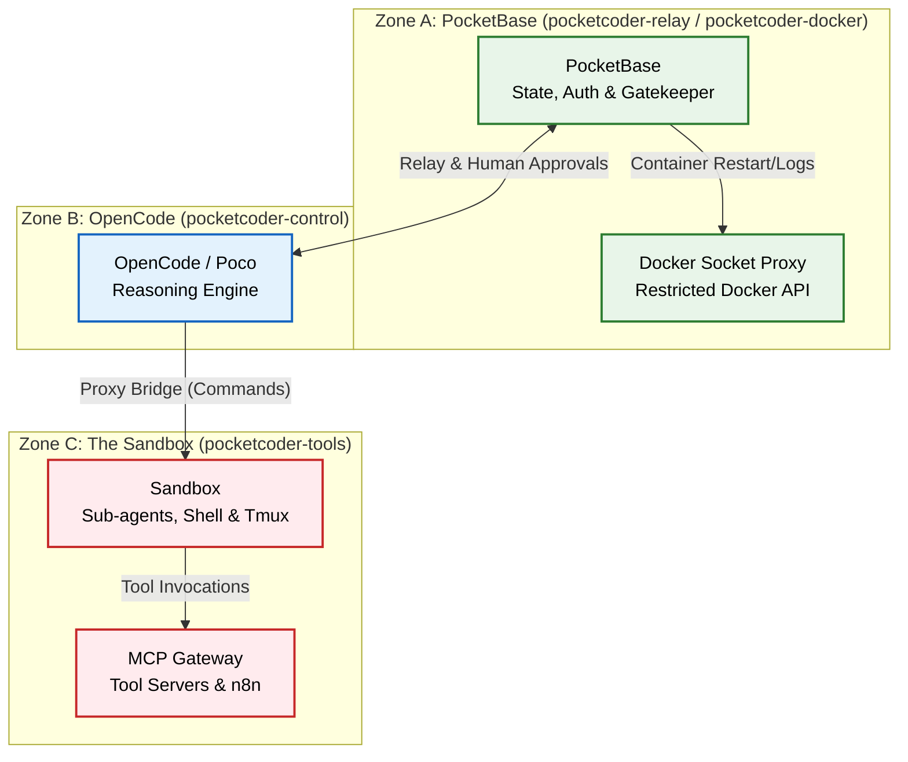

PocketCoder is designed with a "Paranoid by Default" security model. We assume that AI models can hallucinate, make mistakes, or be manipulated, so we enforce strict isolation at the infrastructure level.

## 1. The Core Principle: Reasoning vs. Execution Isolation

The most critical security feature is the complete separation of **Reasoning** (OpenCode/Poco) from **Execution** (The Sandbox/Sub-agents).

- **OpenCode (Poco)**: Lives in the `opencode` container. It has **zero access** to the host machine or the outside world directly. It effectively lives in a strict isolation boundary, able only to "speak" to its internal memory (PocketBase) and the Relay.
- **The Sandbox**: Lives in a separate, hardened `sandbox` container. It has all the tools (compilers, git, bash) but **zero agency**. It can only act when OpenCode commands it via the Relay.

### System Architecture Diagram

## 2. The Relay & Proxy: The Air Gap

The infrastructure connecting OpenCode to the Sandbox consists of two parts:

- **The Relay (Go)**: Logic & Permission. It receives OpenCode's intent, checks it against your permission rules, and asks for your approval if needed (Human-in-the-Loop).
- **The Proxy (Rust)**: Dumb Execution. It is a lightweight server sitting inside the Sandbox. It accepts *only* pre-approved execution packets from the Relay and forwards them to the local `tmux` session.

**Poco cannot "just run bash".** It must request a tool call. The Relay intercepts this, holds it for your "Accept/Reject", and only then sends the sanitized command to the Proxy.

## 3. Docker Network Isolation

We leverage Docker's strict networking (`docker-compose.yml`) to enforce these physical zones:

- **Zone A (PocketBase)**: Connected to `pocketcoder-relay` and `pocketcoder-docker`. Uses `Docker Socket Proxy` to lock down container manipulation.
- **Zone B (OpenCode)**: Connects to Zone A (`pocketcoder-relay`) for memory, and Zone C (`pocketcoder-control`) to issue commands. It has NO access to tools directly.
- **Zone C (Sandbox)**: Connects to OpenCode (`pocketcoder-control`) and its tools (`pocketcoder-tools`). It has internet access to download packages, but **CANNOT** talk to PocketBase directly. This strict isolation prevents a rogue script in the Sandbox from modifying your permissions or deleting your database.

## 4. Immutable Infrastructure

The system is resilient by design:

- **Compiled Binary**: PocketBase runs as a compiled Go binary inside its container.
- **Read-Only Root**: Ideally, the container's root filesystem is read-only.
- **Ephemeral State**: If a sub-agent thrashes the Sandbox, you simply restart the container. The damage is contained to that specific ephemeral environment.

## 5. Skills vs. Tools (The Knowledge Firewall)

We enforce a strict separation of concerns for input data:

- **Skills (Markdown)**: Only loaded by **Poco** (OpenCode). Uses a safe parser. If a malicious user sends a "jailbreak" prompt, it stays in OpenCode and can't execute code.
- **MCPs (Tools)**: Only loaded by **Sub-agents** (The Sandbox). These are the only things that can touch the OS. 
- **The Result**: A jailbreak in OpenCode has no execution capabilities. A compromised tool in the Sandbox has no reasoning capabilities.

## Summary

| Layer | Security Control |
| :--- | :--- |
| **Network** | Docker bridge isolation preventing Sandbox -> DB access. |
| **Execution** | Commands must pass through the Relay's Human-in-the-Loop check. |
| **Infrastructure** | PocketBase is a compiled binary in a separate container. |
| **Tooling** | Ephemeral `uvx`/`npx` tools only exist for the lifespan of the task. |

**You are the ultimate authority. The AI is just a guest in your machine.**
