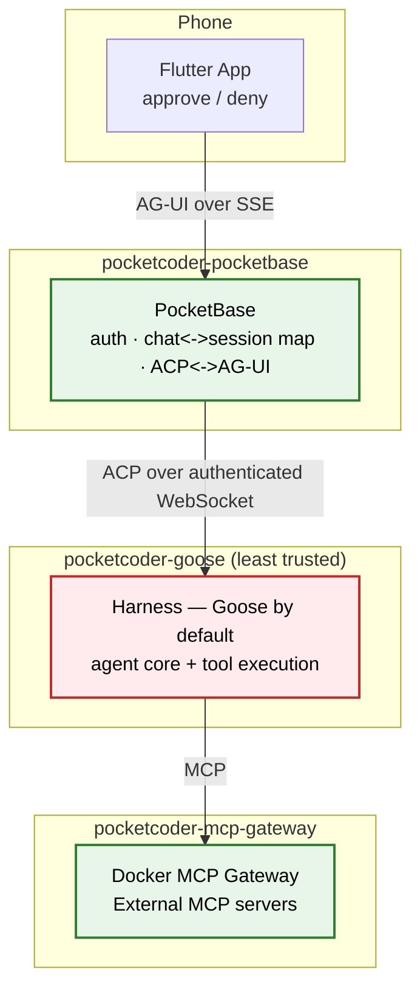

PocketCoder is designed with a "paranoid by default" security model: assume the model can hallucinate, make mistakes, or be manipulated, and put a human approval gate in front of anything it wants to *do*. This page describes the current runtime honestly — including where isolation is deliberately simplified today and what remains dormant future work. For the full write-up (network isolation, credential boundaries, recovery model), see [`SECURITY.md`](https://github.com/qtpi-bonding-org/pocketcoder/blob/main/SECURITY.md) in the repository.

## 1. The Core Principle: Approval-Gated Execution

The agent core (the **harness container**, Goose by default) can reason freely, but it cannot take a consequential action without your explicit say-so. Every tool call the harness wants to make surfaces through the ACP `session/request_permission` flow, which **PocketBase** turns into a real-time approve/deny prompt on your phone.

- **PocketBase**: the authenticated front door. It verifies the chat owner, holds the single `chat_id → goose_session_id` mapping, and translates between ACP (facing the harness) and AG-UI (facing the phone). It holds no model credentials of its own beyond the secret used to reach the harness.
- **The harness container**: the least-trusted container. This is where tool execution actually happens today. It's modeled as "assume this could be compromised," and the isolation around it is what bounds the blast radius.
- **The MCP gateway**: runs by default and brokers external MCP servers, approved per-deployment.

### System Architecture Diagram

## 2. The Human-in-the-Loop Approval Gate

How a tool call is gated:

1. The harness decides to call a tool and issues an ACP `session/request_permission` with a fixed set of offered options (e.g. allow-once, allow-always, reject-once).
2. PocketBase records this as an in-memory pending permission and pushes an AG-UI update so your phone shows the prompt.
3. You pick one offered option. PocketBase forwards it verbatim to the harness and does not persist it in its database.
4. The harness proceeds (or not) according to your choice.

Pending approvals are process-local and expire after a configurable timeout (five minutes by default). Expiry, cancellation, and a graceful PocketBase shutdown all send the harness a `cancelled` decision so it doesn't hang blocked. Approvals are not persisted or replayed — a PocketBase restart drops any in-flight approval; the durable harness session simply resumes on the next run.

## 3. Network Isolation

- The harness container publishes no host port and joins only a shared private network with PocketBase.
- The PocketBase↔harness channel is an authenticated ACP-over-WebSocket connection. The harness refuses to serve without its server secret key; PocketBase is the only component holding that secret, and it is not exposed to the Flutter client.
- The harness does not hold PocketBase credentials — there is no harness-to-PocketBase call path that carries authority.
- The shared network is bidirectional, so this is an identity- and scope-based boundary, not an air gap: a compromised harness could reach PocketBase, but it holds no credentials and is bounded by PocketBase's collection access rules.

## 4. Where Isolation Is Deliberately Simplified Today

Be clear-eyed about the current runtime:

- **The harness executes its own built-in shell and filesystem tools inside its own container.** There is no separate hardened execution sandbox in the request path today — PocketBase advertises no ACP filesystem/terminal callbacks and has no network route to a sandbox. The approval gate above is what stands between the model and execution, not a second container.
- **A Rust sandbox proxy and ACP adapter exist in the repository but are dormant** — future security-hardening work, not part of the PocketBase↔harness path today. See [`dormant/`](https://github.com/qtpi-bonding-org/pocketcoder/blob/main/dormant/) in the repository.
- **MCP tool attachment through the selected harness build is still maturing**, so external MCP tools — and the assumption that their calls also pass through the approval gate — shouldn't be taken for granted until that work is further along.

The upshot: today's security story is "every action requires human approval, over an authenticated channel, from a container that holds no credentials" — a solid gate, but not yet the multi-container reasoning/execution isolation that the dormant sandbox components are intended to eventually provide.

## 5. Immutable & Recoverable Infrastructure

- **Compiled binary**: PocketBase runs as a compiled Go binary.
- **Ephemeral execution**: if the agent thrashes its own container, restart the harness container — its session store persists independently, so history survives while transient damage does not.
- **Separated durable state**: PocketBase state and harness state live in separate volumes, backed up independently.
- The included PocketBase backup volume is an on-host recovery copy, not an off-host disaster backup — VPS loss, disk failure, or provider/account loss can still destroy it.

## Summary

| Layer | Control |
| :--- | :--- |
| **Execution** | Tool calls require an explicit, offered-option approval relayed to your phone. |
| **Channel** | PocketBase↔harness is an authenticated WebSocket; only PocketBase holds the shared secret. |
| **Network** | The harness publishes no host port, sits on a private network, and holds no PocketBase credentials. |
| **Blast radius** | The harness container is treated as untrusted and holds no durable secrets; restart recovers cleanly. |
| **Honest caveat** | Tools currently execute inside the harness container itself; the hardened sandbox is dormant future work. |

**You hold the approvals. The agent only acts within what you've approved.**
